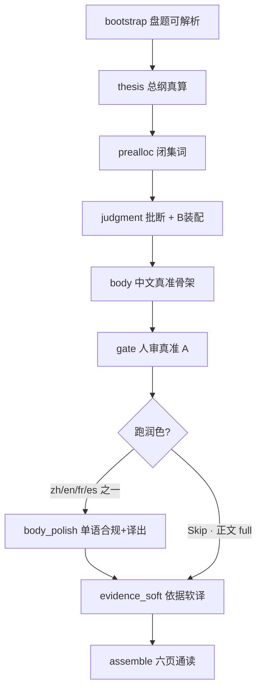

# 交付 v3 · 分步职责与合格尺（SSOT）

> **权威**：Lab / 生产改 duty、喂料、闸门前先读本文。  
> 产品三步见 `交付报告-三步链路-架构.md`；润色合同见 `交付v3-正文润色-body_polish-规格.md`；升闸操作见 `交付v3-Lab人审与升闸操作手册.md`。  
> **约定**：Lab 翻车 → 先查本文「哪一步的尺」→ 只改该步 duty/喂料/闸；禁止跨步甩锅式补丁。

## 0. 产品三步 ↔ Lab 细步

| 产品步 | Lab 细步 | 一句话 |
|--------|----------|--------|
| ① 内容生成 | `judgment` + `body` | 先批断、后正文；枪内不靠返工装合格 |
| ② 闸门验收 | `gate`（+ 已挂 early 类别机检） | **A** 只判不改；不过回改正文/批断枪 |
| （②→③ 之间 · 六页） | `body_polish` | 合规加厚 + 清表面 + **单语译出**（可 Skip）；**B** 盖回锚点 |
| ③ 依据合规 | `evidence_soft` | 只动依据折层；不改正文 |

前置：`bootstrap` → `thesis` → `prealloc`。收尾：`assemble`。  
**改输出界（A 验收 / B 装配 / C 禁伪修）**：`交付报告-三步链路-架构.md`「改输出的三条界」——勿把 B 当成闸内违规改稿。

**Canonical 骨架**：body 仍中文生成 + gate 人审真准（P4 三问等）——**不因多语改人审母语**。  
**Lab**：可只跑一种语言或 Skip；**不要求**四语齐套才能 unlock soft。  
**生产（本轮不接）**：将来按 `site.locale` 只跑对应那一份润色。

## 1. 分步职责矩阵

| 步 | 负责（过关标准） | 不负责 | 硬闸 / 人审 | 交给下游的冻结物 |
|----|------------------|--------|-------------|------------------|
| bootstrap | 盘 + 问题可解析 | 内容质量 | 机检有无 | source 可用 |
| thesis | 总纲维与 structured 对齐 | 处方 / 手段 | 本地真算 | fingerprint 冻结总纲 |
| prealloc | 本盘闭集词 + Fact-pack（P4 含奇门锁盘） | 写正文 | 缺盘 / 缺奇门 fail | chart_fact_pack |
| judgment | 本页机制批断；页责不串；禁处境处方主语；落库前 **B** 钉 path/ref/moat | 白话执行稿、读感加厚；**C** 剥句妆合格 | 已升类别闸（**A**）+ 人审「机制真」 | plan.units |
| **body** | **真 · 准 · 可执行 · 贴收集 · 页定位**；删批断须垮；**换壳同禁** | **加厚读感、译出、专名精修** | **事实类硬闸（substance_only）**；表面类 defer（Skip 时回退 full） | page_schema 事实稿 |
| gate | 人审：值钱？页角色对？因果成立？（**中文骨架**） | **代写内容**、润色、**C** | Phase A 形状 + 人审 checklist（**A**） | 批准的事实稿 |
| **body_polish**（P1–P6） | **合规加厚 + 目标 locale 出稿 + 清表面**；一次一语；**B** 盖回锚点；可 Skip | 改主张 / 数字 / 门槛 / 条数；一枪四语 | **full（A）** + 厚度闸；Skip → 正文 **full**；不过不覆盖正文 | 用户可见终稿（`page_schema_by_locale`） |
| evidence_soft | 依据折层软译 / 冻结 | 改正文 | 形状 | marked evidence |
| assemble | 六页通读预览 | 重生内容 | 有稿即可 | preview |

### 1.1 body vs polish（硬分界）

| | body | polish |
|--|------|--------|
| 北星 | 说清楚、说准确、今晚能动 | 给人读、合规、出站语言 |
| 加厚 / 译出 | **禁止逼写厚 / 译出** | **负责加厚 + 单语译出（含 zh→zh）** |
| 专名 / 引号 / X% / 开口稿 | 尽量；硬闸 **defer** | 硬闸 **full**（Skip 则 body 须 full） |
| 已拒路径 / 编造截止点 | **硬闸在此** | 禁为写厚再发明；撞了仍 fail |
| 换壳同禁 | duty 元规则 | 润色禁区同尺 |

### 1.2 Skip 与表面闸回退

| 路径 | body 表面 | polish | soft 解锁条件 |
|------|-----------|--------|----------------|
| 跑润色（任一 locale） | substance_only | full + 厚度 | 该 locale 稿过闸 |
| Skip polish | 对冻结稿跑 **full** | 不调用 LLM | full 过 → `polish_skipped` |

## 2. P1–P6 差异

| 页 | judgment | body（事实轴） | polish（表面/读感；可 Skip） | evidence_soft |
|----|----------|----------------|------------------------------|---------------|
| P1 direct_answer | 主辅真算根（禁奇门承重） | collecting 同向；禁发明月数；backup 不拧轴 | 专名；电报体 → 加厚+locale | 无（UI 不挂依据） |
| P2 foundation | 四轴机制；禁奇门轴 | essence 禁怎么办；条数=批断 | 宫位/合冲/岁运报幕；过薄 | 有 |
| P3 science_action | 六维结构批断 | 已拒路径；禁编造时长/cliff/% | 专名/引号/X%；过薄 | 有 |
| P4 metaphysics_action | 双核结构批断 | 玄学 means；禁试水/P3 工具；人审三问 | 专名/开口稿/养生/物化/话语权；禁译成合同腔 | 有 |
| P5 risk_guard | 坑与防法批断 | 指回上游；禁新药方墙 | 专名；恐吓腔 | 有 |
| P6 signals_close | 摘上游批断 | 摘上游；禁甘特 | 专名；空喊 | 有 |

## 3. 翻车归属（防再抽奖）

| 失败类别 | 归属步 | 正确动作 |
|----------|--------|----------|
| 主张假 / 批断机制垮 / 处境词进 claim | judgment | 改 judgment duty/喂料，重跑 judgment |
| 删批断仍成立 / 像错页 / 手段与收集冲突 | body | 改 body duty/菜单，重跑 body |
| 已拒路径：主轨试水 / 辅轨「项目制半投入换皮」 | **body**（事实） | 路径闭集表；**允许**按次顾问+保住现职；禁追「保留现有」二字误杀 |
| 编造时长/截止点/节律（前N月、两周内、明天内、每半月、列出N位…） | **body**（事实） | 扩**类别**尺；禁追本案二字 |
| 编造未收集的成熟期/cliff/行权年数 | **body**（事实） | `gate_p3_body_invented_contract_term`；写「按书面约定节点」 |
| 可见专名、引号台词、X% 占位、开口稿换壳 | **polish**（跑润色时）；Skip 则 **body full** | 改 polish 合同或改正文后 Skip |
| 读感薄 / 同义换词未加厚 / 电报体 | **polish** | 厚度闸 + 提示词；**勿**回逼 body「加厚」 |
| 译出机器腔 / P4 译成 HR·合同腔 | **polish**（locale 包） | 改 locale task；禁案例补丁 |
| 依据专名展示不合格 | evidence_soft | 不改正文枪 |
| 串页喂料 / 奇门进非 P4 | page-feed-policy + 该枪 duty | 改喂料白名单 |

**升闸**：按类别挂在归属步对应的 `gate-*-category.ts`；禁止用本案 Lab 原句当唯一正则。

## 4. 合格交付报告如何拼成

用户最终看到的一页 =：

1. **judgment** 提供机制真（折叠依据源）  
2. **body** 提供事实正确、可执行的中文骨架  
3. **gate 人审** 确认值钱且页角色对（中文）  
4. **polish** 把骨架加成合规可读终稿并出目标语言（或 Skip 且正文已过 full）  
5. **evidence_soft** 把批断装进依据折层（可软译）  

缺任一步达标 → 禁止推进（因果链铁律）。Skip 不算豁免表面漏洞。

## 5. 改代码前自检

1. 这次失败属于 §3 哪一行？  
2. **先回溯上游**：Thesis / Prealloc·锁盘 / 喂料白名单 / 派工·批断是否已含处方成句或脏 priming？根在上游则改上游，禁止只拧当前步。  
3. 只改该行归属步的 duty / 喂料 / 闸？（上游已清之后）  
4. 是否把读感问题甩回 body、或把事实问题甩给 polish？→ 是则停手。  
5. 新正则是否写成类别（换盘仍成立）？追本案二字 → 停手。  
6. Skip 路径是否仍会跑 full 表面闸？→ 否 = 违规。  
7. 本地真算是否在写处方成句？→ 是则删成句、只留参数（路径一）。
