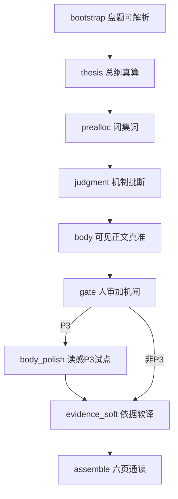

# 交付 v3 · 分步职责与合格尺（SSOT）

> **权威**：Lab / 生产改 duty、喂料、闸门前先读本文。  
> 产品三步见 `交付报告-三步链路-架构.md`；润色合同见 `交付v3-正文润色-body_polish-规格.md`；升闸操作见 `交付v3-Lab人审与升闸操作手册.md`。  
> **约定**：Lab 翻车 → 先查本文「哪一步的尺」→ 只改该步 duty/喂料/闸；禁止跨步甩锅式补丁。

## 0. 产品三步 ↔ Lab 细步

| 产品步 | Lab 细步 | 一句话 |
|--------|----------|--------|
| ① 内容生成 | `judgment` + `body` | 先批断、后正文；枪内不靠返工装合格 |
| ② 闸门验收 | `gate`（+ 已挂 early 类别机检） | 只判不改；不过回改正文/批断枪 |
| （②→③ 之间 · P3 试点） | `body_polish` | 可见层加厚读感 + 清表面类；不改事实主张 |
| ③ 依据合规 | `evidence_soft` | 只动依据折层；不改正文 |

前置：`bootstrap` → `thesis` → `prealloc`。收尾：`assemble`。

## 1. 分步职责矩阵

| 步 | 负责（过关标准） | 不负责 | 硬闸 / 人审 | 交给下游的冻结物 |
|----|------------------|--------|-------------|------------------|
| bootstrap | 盘 + 问题可解析 | 内容质量 | 机检有无 | source 可用 |
| thesis | 总纲维与 structured 对齐 | 处方 / 手段 | 本地真算 | fingerprint 冻结总纲 |
| prealloc | 本盘闭集词 + Fact-pack（P4 含奇门锁盘） | 写正文 | 缺盘 / 缺奇门 fail | chart_fact_pack |
| judgment | 本页机制批断；页责不串；禁处境处方主语 | 白话执行稿、读感加厚 | 已升类别闸 + 人审「机制真」 | plan.units |
| **body** | **真 · 准 · 可执行 · 贴收集 · 页定位**；删批断须垮 | **加厚读感、专名精修** | **事实类硬闸**（已拒路径 / 编造时长等）；表面类有 polish 的页 defer | page_schema 事实稿 |
| gate | 人审：值钱？页角色对？因果成立？ | 改稿、润色 | Phase A 形状 + 人审 checklist | 批准的事实稿 |
| **body_polish**（仅 P3 试点） | **加厚完整句 + locale + 清表面类** | 改主张 / 数字 / 门槛 / 条数 | **full**（表面 + 事实）；不过不覆盖正文 | 用户可见终稿 |
| evidence_soft | 依据折层软译 / 冻结 | 改正文 | 形状 | marked evidence |
| assemble | 六页通读预览 | 重生内容 | 有稿即可 | preview |

### 1.1 body vs polish（硬分界）

| | body | polish |
|--|------|--------|
| 北星 | 说清楚、说准确、今晚能动 | 给人读、读得顺 |
| 加厚 | **禁止逼写厚** | **负责加厚** |
| 专名 / 引号 / X% | P3：尽量；硬闸 defer | P3：硬闸 full |
| 已拒路径 / 编造截止点 | **硬闸在此** | 禁为写厚再发明；撞了仍 fail |

## 2. P1–P6 差异

| 页 | judgment | body | polish | evidence_soft |
|----|----------|------|--------|---------------|
| P1 direct_answer | 主辅真算根（禁奇门承重） | 直答主辅白话；表面专名硬闸在 body | 无 | 无（UI 不挂依据） |
| P2 foundation | 四轴机制；禁奇门轴 | ≈译批断；表面专名硬闸在 body | 无 | 有 |
| P3 science_action | 六维结构批断 | 真准可执行、**不加厚**；事实闸在 body | **试点** | 有 |
| P4 metaphysics_action | 双核结构批断 | 局势/意象/仪轨；表面闸暂在 body | 暂无（稳定后按同矩阵扩） | 有 |
| P5 risk_guard | 坑与防法批断 | 指回 P3/P4；暂无 polish | 无 | 有 |
| P6 signals_close | 摘上游批断 | 今晚+近7日；暂无 polish | 无 | 有 |

## 3. 翻车归属（防再抽奖）

| 失败类别 | 归属步 | 正确动作 |
|----------|--------|----------|
| 主张假 / 批断机制垮 / 处境词进 claim | judgment | 改 judgment duty/喂料，重跑 judgment |
| 删批断仍成立 / 像错页 / 手段与收集冲突 | body | 改 body duty/菜单，重跑 body |
| 已拒路径、编造时长/截止点（两周内、三天内、连续N月…） | **body**（事实） | 扩**类别**尺；禁追本案二字 |
| 编造未收集的成熟期/cliff/行权年数 | **body**（事实） | `gate_p3_body_invented_contract_term`；写「按书面约定节点」 |
| 可见专名、引号台词、X% 占位 | **polish**（有 polish 页）；否则 body | 改 polish 合同或该页 body |
| 读感薄 / 电报体 / 不够好读 | **polish** | **勿**回逼 body「加厚」 |
| 依据专名展示不合格 | evidence_soft | 不改正文枪 |
| 串页喂料 / 奇门进非 P4 | page-feed-policy + 该枪 duty | 改喂料白名单 |

**升闸**：按类别挂在归属步对应的 `gate-*-category.ts`；禁止用本案 Lab 原句当唯一正则。

## 4. 合格交付报告如何拼成

用户最终看到的一页 =：

1. **judgment** 提供机制真（折叠依据源）  
2. **body** 提供事实正确、可执行的可见骨架  
3. **gate 人审** 确认值钱且页角色对  
4. **polish**（P3）把骨架加成可读终稿并清表面类  
5. **evidence_soft** 把批断装进依据折层（可软译）  

缺任一步达标 → 禁止推进（因果链铁律）。

## 5. 改代码前自检

1. 这次失败属于 §3 哪一行？  
2. 只改该行归属步的 duty / 喂料 / 闸？  
3. 是否把读感问题甩回 body、或把事实问题甩给 polish？→ 是则停手。  
4. 新正则是否写成类别（换盘仍成立）？追本案二字 → 停手。
