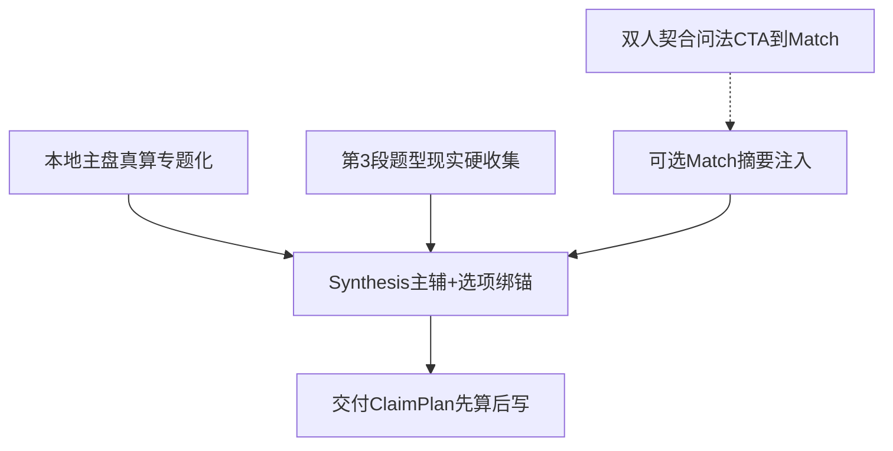

# Pivot 真算优化 P0–P3 + 合盘取舍

> 状态：已确认 · P0–P2 完成 · P3 三项（用神格局/career/型人）已落地  
> 日期：2026-08-31  
> 范围：P0–P3 整体优化；合盘策略本文件锁定（可改口但需显式推翻）

---

## 合盘取舍（锁定）

### 结论

**Pivot 第4阶段交付不接入「第二盘 structured 重算 / 双人合盘引擎」。**  
合盘真算与双人契合报告继续由 **Match** 独立产品承担。

### 为什么

| 维度 | 全量接入合盘进 Pivot | 本方案 |
|------|----------------------|--------|
| 产品边界 | 与 Match 重复，交付变「半个合盘报告」 | Pivot = 破局方案；Match = 双人机制 |
| 工程 | 双盘收集、二次真算、闭集、UI | 主盘 + 收集 + 已有 Match 注入 |
| 合作关系 | 合作≠感情，却被迫吃合盘流程 | 一律「你侧结构 × 对方角色型人」 |
| 用户价值 | 易冲淡「你怎么破」 | 交付始终回答你的主辅打法 |

合作牵涉感情/事业/决策/生活——**更说明合盘不该当 Pivot 默认输入**：合盘答「两人机制」，Pivot 答「在你盘 + 这段关系约束下你怎么走」。

### 二元关系困境时交付定位

```text
主锚 = 用户主盘（structured + pack + Stage-2/Synthesis）
对方 = 非第二主盘：
  ① 结构「适配/张力型人」描述（贵人/比劫/官杀/配偶宫等从主盘推出）
  ② 第3段收集：对方真实行为、态度、权力位、底线（现实锚）
  ③ 若已跑过 Match：注入合盘摘要作关系机制锚（不重算、不另开合盘专题）
需要「我们合不合 / 双人契合度」→ CTA 引导 Match
```

- **可以写**：以你的结构，这类合作/伴侣容易在 X 耗你；你的主路径是…；对方侧观察信号是…  
- **禁止写**：无对方盘却断言其八字性格/运势；把交付写成合盘报告翻版  

已有接线：`lib/llm/prompts/tool-result-injection.ts`、`lib/poju/tool-linking-routes.ts`。

**未来可选（不在本 P0–P3）：** 选接合盘摘要进 Wave C——仍只摘要锚，不重算双盘。

---

## 总目标

1. **准** — 判断挂本地真算锚  
2. **可行** — 挂第3段现实锚  
3. **护城河** — 换盘/换现实必须变；删锚正文垮  
4. **二元不翻车** — 主盘 + 型人/收集/Match 分工清晰  



---

## P0 · 立刻影响准/可行/护城河

### P0-1 题型类型化真算字段（本地）

从已有十神/宫位/关系确定性推出可引用对象：

| 字段族 | 用途 | 题型 |
|--------|------|------|
| 财/官张力与极性 | 事业/财富主辅性质 | career / wealth |
| 配偶宫 + 关系焦点状态 | 感情/人际「你侧」 | relationship / interpersonal |
| 比劫/食伤等合作极性 | 合作「型人」 | career / decision |
| 身财/身官粗平衡 | 决策代价 | decision / wealth |

落点：`lib/calculations/` 或扩展 `core-judgments` / inventory → Stage-2 → Synthesis `chart_anchors` 池。

### P0-2 大运对本案「攻守松紧」

当前大运步增加相对用神/题型的 favor/caution 极性（非日期点），喂 P2/P5/P6。

### P0-3 第3段题型现实硬收集

按 `question_category` 最低 `reality_anchors`；缺则 `needs_validation`。  
二元必收：对方角色、可观察行为、你的底线——**不要求对方生辰**（除非走 Match）。

### P0-4 单元 chart_anchors 质量闸

P2–P5 关键单元非空；与 inventory 交集；跨页万金油复读先日志后硬闸。

### P0-5 二元关系提示词与验收

Stage-2 / Synthesis / P1–P5 + `pivot-八页交付验收标准.md`：主盘+型人+现实；禁对方妄断；「合不合」→ Match CTA。

---

## P1 · 交付链路钉缝

| ID | 内容 |
|----|------|
| P1-1 | P6 `SEGMENT_COMPUTED_INPUTS` 对齐蓝图（Brief + rhythm + 轻量锚） |
| P1-2 | Synthesis 选项×结构双绑 `chart_anchors` + `reality_anchors` |
| P1-3 | P5 1:1 RiskItem 与书页 UI 模块回归；覆盖率失败续跑文案 |
| P1-4 | Match 摘要注入规范化为 relation_mechanism_anchors（不重算） |
| P1-5 | 三盘对照自动评测 P3/P4/P5 |

---

## P2 · 六页提示词细收

| 页 | 要点 |
|----|------|
| P1 | 继承 Synthesis 锚；二元案点明打法在你侧 |
| P2 | Finalize↔卡级 ClaimPlan；表象来自收集 |
| P3 | 先锚后手段；合作案是你可执行边界，非给对方算命 |
| P4 | pack 真算维；型人用贵人/互补气质 |
| P5 | 执行刹车；对方行为可作触发，根在你结构易栽 |
| P6 | Brief 可追溯；禁新开药方/合盘专题 |

---

## P3 · 中期

- 用神/格局启发式升级  
- `pack.career` 去口号化  
- 流月/流日是否进交付（默认阶段定性）  
- Match↔Pivot 产品文案边界  
- （可选）合盘摘要进 Wave C  

---

## 明确不做

- Pivot 交付内第二盘排盘 / 完整合盘引擎  
- 无对方生辰时对对方做命理断言  
- 无引擎流派（如紫微）灌进提示词  
- 医疗脏腑、替做合同/完整话术  

---

## 实施波次

1. 合盘纪律 + 二元收集/提示词/验收（P0-5 + P0-3 二元）  
2. 类型化字段 + 大运松紧（P0-1/2）  
3. Synthesis 选项绑锚 + 单元锚闸（P0-4 + P1-2）  
4. P6 吃料 + Evidence/UI + 三盘评测（P1）  
5. 六页提示词细收（P2）  
6. P3 按需排期  

---

## 成功标准

- 单人案：删锚药方垮；换盘 P3/P4/P5 变  
- 二元案：主锚用户主盘；有型人+现实；无对方盘妄断；「合不合」有 Match CTA  
- 已注入 Match：可引用摘要，不复制合盘书结构  
- full 空锚 / Evidence 缺槽仍拒收  
